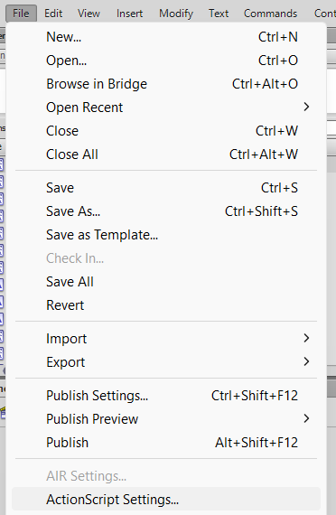
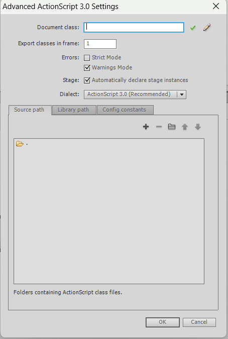
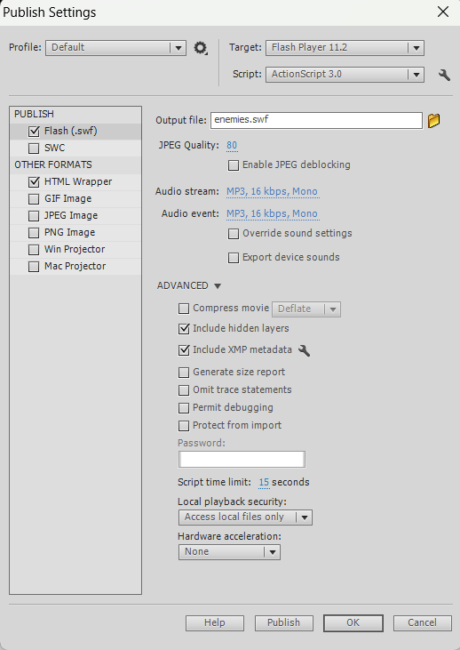

---
tags:
  - SWF
---
# SWF Modding

SWFs are the second of two major modding portions of Mewgenics. SWF files, located in the swf folder, are pieces of animation that the game reads. The [SWF section of this wiki](SWF_home.md) explains in further detail.

## What is a SWF file?

An SWF file is a Adobe-specific file that can only be opened by it's applications. However, because SWFs are "packed" versions of the overall data of the file, to edit your own files have the SWF unpacked in the decomp tool, which can be downloaded [here.](TOOLS_home.md)

## Recommendations for SWF modding

It's HIGHLY recommended to use base objects from FLAs from the game's output to reference for sizes, shapes, consistencies, and more. You can find templates for each major .fla file in [here.](TOOLS_flatemplates.md)

## Importing SWF's FLA files

To actually unpack and look at a SWF, it first must become "uncompressed" in a sense and be turned into a FLA file.
To do that, use the link above for exporting FLAs. Once you have done that, your FLA should open.

To know it's a FLA for CERTAIN (outside of the file name) make sure the name in the Adobe tab once opened is NOT "Untitled" and is the file name instead. You should be able to interact and see all moviescripts and other components from the library tab.

## Exporting FLAs into SWFs

There are two major important settings that MUST be turned off for the FLA's published SWF to properly load ingame.
Both strict settings and compress settings make the movie unreadable to the game. Therefore, they must be turned off.

To turn it off, first open the tab "file".


Go to "Actionscript Settings", and turn OFF strict settings.



Then, open file again and go to "Publish Settings", and turn OFF compress movie.



You should be good to go! Just remember to actually publish it.

???+ warning
    **NEVER** name your SWF something ingame! If your SWF has a object which is specific to one file, instead **APPEND** your moviescript object! You can learn more about that [here.](SWF_appendation.md)


## Loading SWF files ingame

The only way to properly load SWF files into the game is by putting it in an appended swflist.

In the same folder as your SWFs, create a file named "swflist.gon.append".

???+ example Example Code

    Rename "myswf" into the name of your swf.
    ```txt
    loader loader.swf

    game [
      myswf.swf
      myfurniture.swf
    ]

    per_file_curve_resolution {
      myfurniture.swf 3
    }
    ```