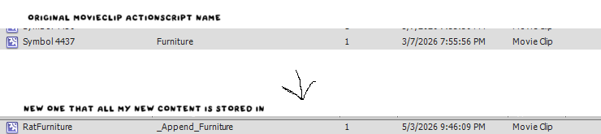

---
tags:
  - SWF
---
# Appending SWFs

## Why to Append

Certain .GON objects are defined from frame labels or Actionscript labels in moviescripts. Because of this, the only way to add more of these objects is to append our own moviescripts to the original!

## How to Append

This is possible through the Actionscript label of the main movieclip all of one type of object's SWFs are stored in, and adding the prefix "_Append".

When making a new file for a object you want to append to, it's recommended to copy and paste some portion of the original moviescript over into your new moviescript to get a on-hands example of what you should do in terms of setup.

i.e.

???+ code
    For example:
    `Furniture -> _Append_Furniture`
    `modular_cutscenes_fla.BossArt_3 -> _Append_modular_cutscenes_fla.BossArt_3`