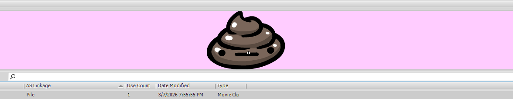
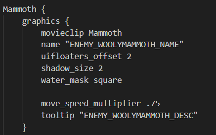
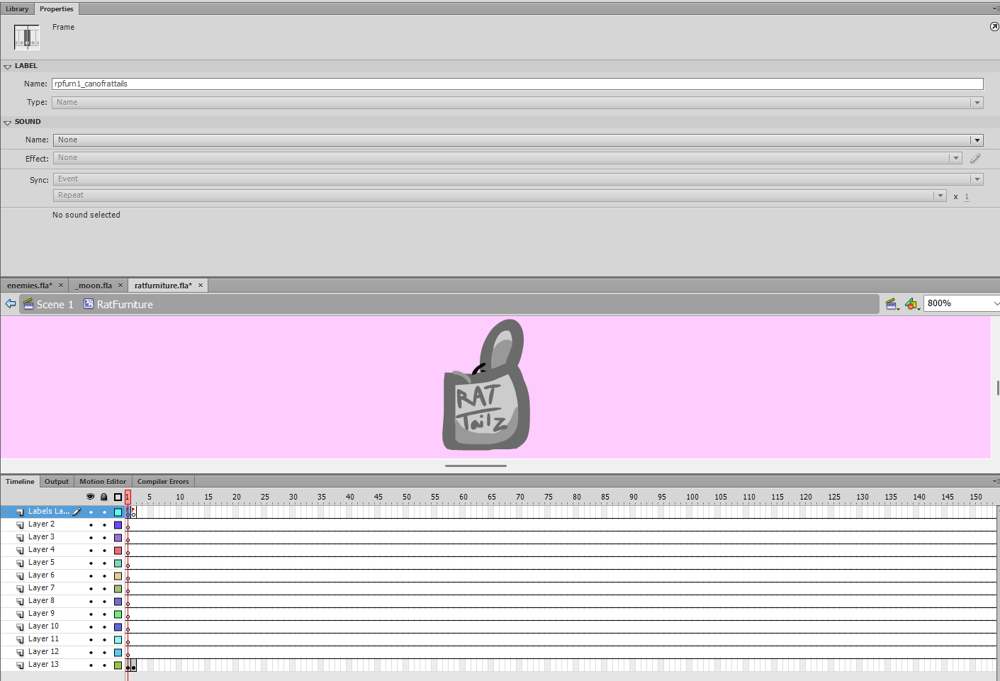
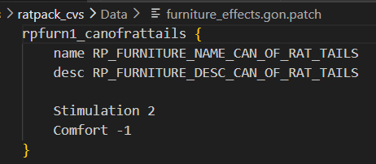

---
tags:
  - SWF
---
# Swf General

SWFs are sets of moviescripts in a file that the game uses to represent different objects visually. Every sprite, cutscene, NPC, etc. that you see is stored in a SWF that can be unpacked into a FLA.
Movieclips are sets of either other movieclips that contain animations, animations, or specific shapes that are manipulatable in tweens.

Every movieclip has a property in the library called "AS Linkage", otherwise known as "Actionscript Linkage". In some scenarios, the game can read these and apply them to .GON objects.

(For instance, in the image above, the game reads the SWF file and when the character object Pile calls for the animation Pile, the game adequately supplies.)

# Relation to .GON Files

There are three sorts of relations that .GON objects can have to .SWF movieclips.

## Referencing Moviescripts

GON Objects such as the objects for entities found in "characters" CALL a moviescript's name for it's animation. It then uses these animations from the moviescript to visually represent it's actions on the screen.

This applies to:
- Entities (Battlefield)
- TODO

(A wooly mammoth's AI calls upon the moviescript "Mammoth")

## Moviescript Reliance

GON Objects such as pieces of furniture are defined from one moviescript, usually with a visual frame and a label frame in a different layer on the same number frame. The label frame will be what defines the name of the object once created from the SWF moviescript.

To add these as custom swfs, a seperate and custom file must have a moviescript that contains the new content set up similarly to the original moviescript. The new moviescript MUST have the actionscript label of the original actionscript, with "_Append" added as a prefix.

???+ code
    For example:
    `Furniture -> _Append_Furniture`

(The name is created from the frame name in the Labels Layer layer, and used later to apply stats to it)

## Frame Reliance

Finally, the most dreaded version of SWF to GON relations. GON Objects such as tiles and random stray body parts are defined from the FRAME of one moviescript. There is no label frame to distinguish it, or actionscript label - making these impossible to mod as of now, as there is no guaruntee what frame it might be when appended if multiple mods are activated that also tamper with the same file.