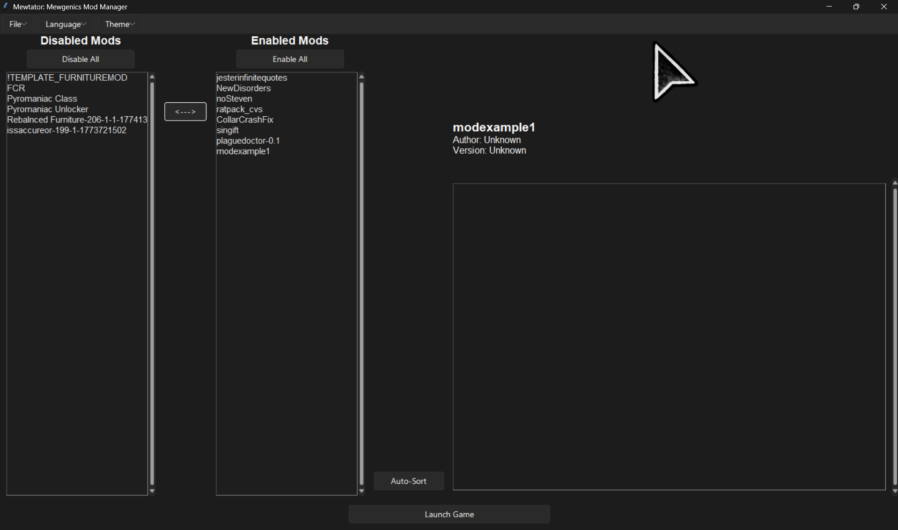
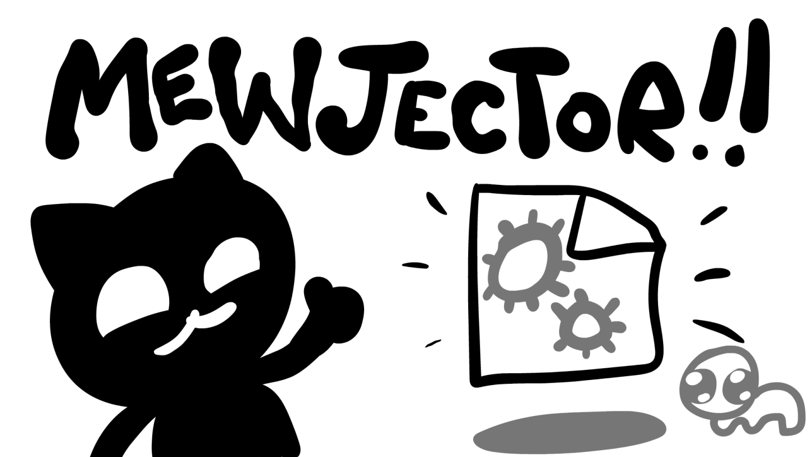
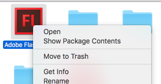

---
tags:
  - Tools
  - Unpacker
  - Flash
  - SWF
---

# Tools

This section of the documentation aims to probide modders a list of popular and useful tools for modding. 

# Starting Tools

There are basic tools all Mewgenics modders use at least once. Here is a list of the most basic tools for starting modding.
As of now, because there is no steam launcher for mods or page for workshop content, most mods have released on Nexusmods.

## Mewtator - Mod Loader

https://www.nexusmods.com/mewgenics/mods/1

As the Nexusmods page described, this is a seperate tool from Mewgenics that launches the game and runs mod scripts, allowing mods to be playable with Mewgenics.

## Mewjector - DLL Mod Loader

https://github.com/githubuser508/mewjector/tree/main

This is, technically, a addition to Mewtator. It allows for DLL mods to be loaded with the rest of the game.

## File Unpacker

https://github.com/ShootMe/GPAK-Extractor

This is the unpacker Tyler supports for unpacking both Mewgenics and The End Is Nigh. All assets and data is put in the Output folder in the same directory as the base EXE.

## Flash CS6 + Download Manual

Flash Download: https://drive.google.com/drive/folders/1y_PzgtYfIyHMc4TnoafC5zHpkgW-13NP 
Download Manual: https://solero.me/t/installing-adobe-flash-professional-cs6-on-windows-10-or-mac/144

Free Flash!
You can also open the FLAs in Adobe Animate, but Mewgenics FLAs are made for flash.

## FLA Decomper

https://github.com/jindrapetrik/jpexs-decompiler 

Unpacks SWF files into FLAs, allowing you to copy the structure of a ingame-SWF. To use, drag a SWF and put it in the .bat file in the folder, then when the application is open, export the FLA.

## Collar Fix

https://github.com/hmrrrrr/CollarCrashFix

Unfortunately, the game tends to crash if you open the menu (showing the collars) and you have all unlocked, including your own. This is because the base game only supports 13. This DLL mod supports more.

# Level (Battle) Creators

There are 2 popular level creators. One supports mod enemies, and one does not, with the pro of having better graphics.

## Mod Support

https://github.com/EulerFrog/mew-editor 

While the UI is basic, and only loaded from the python file, it allows for modded entities by allowing you to put your own ID in a tile.

## Non-Mod Support 

https://www.nexusmods.com/mewgenics/mods/190?tab=posts 

It looks nice. :)

# Custom Stray Tools

## MewVoice

ONLINE: https://mewvoice.com/create 
APP: https://github.com/bobloy/MewVoice/releases

Allows you to record and export your own set of cat sounds. App has more features than online.

## Kitty Editor

https://mewgenics.kittyeditor.com/ 

Allows you to edit a kitty's appearance and save the data for your own stray!

## Cat Data Exposure

https://github.com/githubuser508/exposecatdata/releases 

As Maishul expertly summarizes: _A Mewjector mod that exposes CatData fields to the GON ability system. Formula variables, X is bindings, and Conditional gates are all usable from .gon.append files with no C code required._
