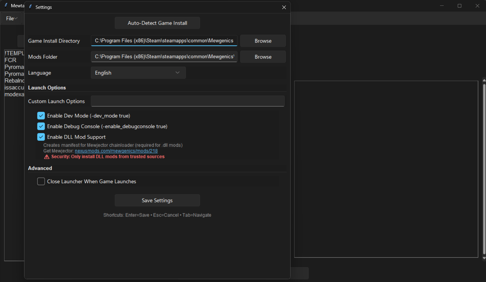
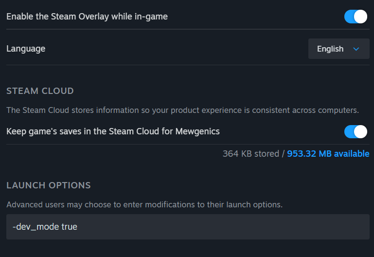
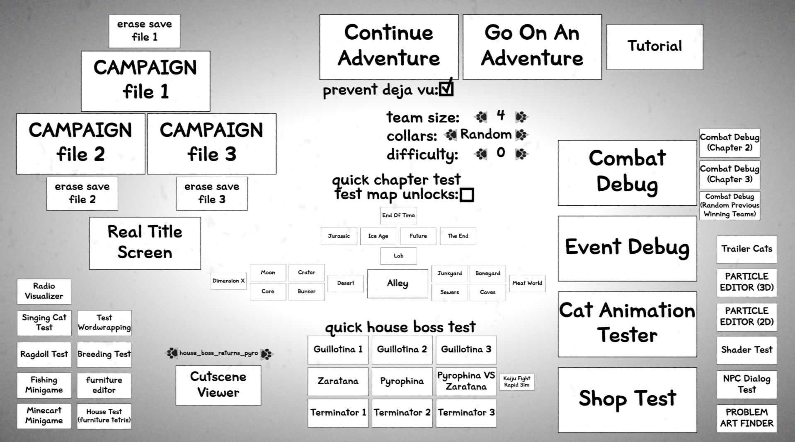

---
tags:
  - Start
  - Tools
  - Debug
---

# How to Start Modding

Mewgenics modding is relatively simple compared to some other games. Because the .gon files are practically open-source, it's easy to see how the game functions. 

## Starting Tools

To get started, you'll need the 
- Mewtator (mod loader), 
- any Adobe program (although Adobe Flash CS6 is recommended), and
- any text opener (VSC or Notepad++ should be fine). 

Those tools can all be found [here](TOOLS_startingtools.md).

## Debug Menu and Debug Console

These can be enabled in a variety of ways.

The easiest is to use Mewtator and go to it's settings.

The first two settings can also be plugged into the game's launcher options, like so.

## Navigating the Debug Menu

If opening with the debug_mode on, you will open up to this menu instead of the title screen.

Here's a quick breakdown of each button:

- CAMPAIGN files; opens up the corrosponding save file. Strangely, 
    - CAMPAIGN File 2 -> Save File 3
    - CAMPAIGN File 3 -> Save File 2
- Real Title Screen: Opens up to the real title screen.
- Go On An Adventure: Puts you on the test map, which is controlled by maps/eventdebug.gon.
    - Team Size: Min 1 Cat, Max 6 Cats.
    - Collars: 
        - Random (chooses up to 5 random classes and gives 4 of each) 
        - Freedom (gives 4 of every collar) 
        - Basic (first 6 classes)
        - All (1 of each collar)
- Continue Adventure: If you had a run on the debug map, continues it.
    - Prevent Deja Vu: Prevents Deja Vu for the event debug map.
- Tutorial: Puts you on the tutorial. 
- Map Buttons
    - Puts you in the respective level of the game.
        - quick chapter test / test map unlock: TODO???
- Combat Debug: Puts you in a free battle ground (which cannot end in win or loss)
    - The other combat debugs do not seem to change anything.
- Event Debug: Puts you on the event debug map. First stop is a event, which you can force (what it is, and your outcomes)
- Cat Animation Tester: Shows the player a random amount of cats facing fowards. Pressing left or right scrolls through the animations the cat has in the 3D enviorment (front and back).
- Shop Debug: Shop debug!
- Trailer Cats: Shows a random cat with a piece of random level background art. Pressing on it makes it do a animtion, once.
- Effect Debug (3D): Tests out a particle effect on a free battle ground. Some of the base ones (such as particle 8) seem to be unfinished as they crash when choosing the option.
- Effect Debug (2D): Tests out particles on the house.
- Shader Test: (TODO???)
- NPC Dialoug Test: NPC face tester to strings of text, starting with the word "testicles" (amazing, tyler). Once pressing space or pressing down, moves onto a long pre-written string of text that uses every text function that plays with how it's presented.
- Problem Art Finder: Scrolls past a long line of pieces of art from the game. (TODO: SEARCH WHERE YOU CAN SET THIS ART)
- Quick Boss House Test:
    - Puts you in the respective battle with each house boss with a set of random fully-leveled cats. The amount and types of cats are based on the changes in Team Size and Collars
- Cutscene-Viewer: Plays the selected cutscene from the Cutscene Moviescript.
- Radio Visualizer: The one and only.
- Singing Cat Test: Allows you to select a track from the levels in the game. Cats can sing along, or make other sounds/animations (Happy, Hurt, Purr, etc).
- Test Wordwrapping: Wordwraps the string "DEBUG_TEST_GERMAN_WORDWRAPPING" from the ingame csv file.
- Ragdoll Test: Tests out the ragdoll feature of the cats in the house portion.
- Breeding Test: Tests effects for visuals of inbreeding. Generates random cats and allows you to breed them, throw them out, etc.
- Fishing Minigame: A scrapped fishing minigame.
- Furniture Editor: Allows you to edit the tiles, anchors, etc. of furniture. Scroll left and right to go through the furniture in the Moviescript, and leaving (after changing stuff) should prompt you to save in the data file.
- Minecart Minigame: A scrapped Dino Run-style minigame.
- House Test: Tests out furniture in the house. Give yourself furniture through the commands "get_furniture" and "get_rare_furniture".

# FAQ

## Playing as a Custom Class

Because there is no debug command to set your class in a battle, your class can only be accessed when starting a new run, specifically in a save file (not in the debug adventure.) Unlock it using "UnlockClass" debug. It's recommended to use a 100%+ save file for testing out a new class.

## Using Custom Actives

While it is your turn in a battle, use "bind" command.