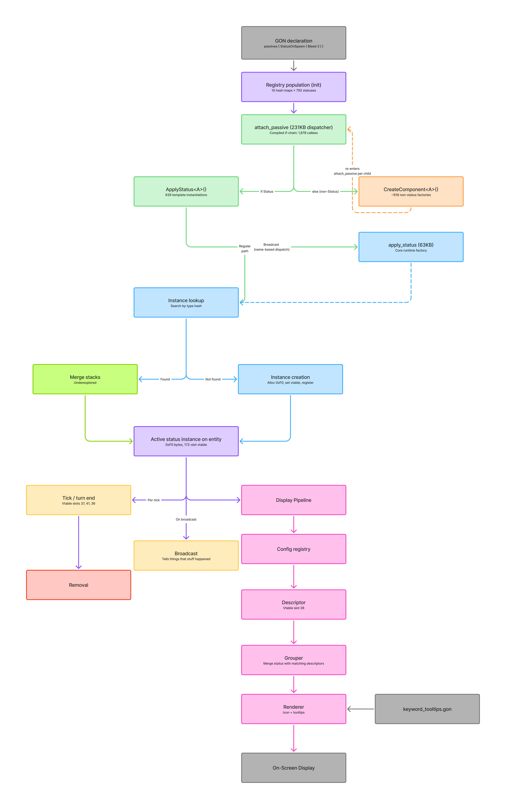

---
tags:
  - Compile
---
# Status Effect Pipeline

This diagram shows the full lifecycle of a status effect in the Mewgenics engine, from GON declaration through registry population, creation, ticking, and display.

For details on how each stage is hooked, see [Custom Status Effects](customstatuses.md).
